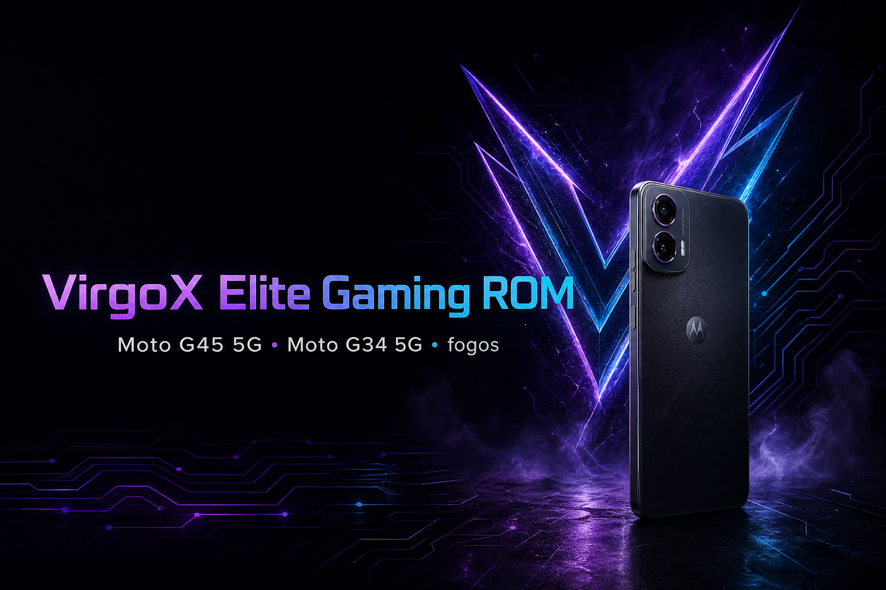

<p align="center">
  
</p>

<h1 align="center">VirgoX-Elite-GamingOS — VirgoX Elite Gaming ROM</h1>

<p align="center">
  A bootable, performance-focused Android gaming ROM for the Motorola Moto G45 5G and Moto G34 5G.
</p>

<p align="center">
  <a href="https://github.com/darkvirgoyt-beep/VirgoX-Elite-GamingOS/releases"></a>
  
  
  
  
</p>

<p align="center">
  <a href="#overview">Overview</a> •
  <a href="#highlights">Highlights</a> •
  <a href="#supported-devices">Devices</a> •
  <a href="#installation">Installation</a> •
  <a href="#building-from-source">Build</a> •
  <a href="#disclaimer">Disclaimer</a>
</p>

---

## Overview

**VirgoX-Elite-GamingOS — VirgoX Elite Gaming ROM** is a bootable custom Android ROM project for the Motorola Moto G45 5G and Moto G34 5G, using the `fogos` device family and the Qualcomm SM6375 platform. The project combines a lightweight LineageOS-based foundation with gaming-oriented framework overlays, system properties, device configuration, performance profiles, and release tooling.

The ROM is designed for users who want a responsive daily driver with a dedicated gaming profile, fast touch and sensor response, adaptive memory behavior across 4 GB and 8 GB variants, and a maintainable source tree for future development.

> **Project status:** Bootable development ROM. Flash only on a supported device and keep a complete backup of your data, modem, persist, boot, vendor, and original firmware partitions.

## Search keywords

`VirgoX-Elite-GamingOS — VirgoX Elite Gaming ROM`, `VirgoX ROM`, `Moto G45 custom ROM`, `Moto G34 custom ROM`, `Motorola fogos ROM`, `SM6375 gaming ROM`, `Android 17 ROM`, `LineageOS fogos`, `Moto G45 gaming ROM`, `Moto G34 gaming ROM`, `KernelSU`, `Magisk`, `GameSpace`, `Fastboot ROM`, `OTA payload.bin`.

## Supported devices

| Device | Codename | Platform | Memory profiles | Status |
|---|---|---|---|---|
| Motorola Moto G45 5G | `fogos` | Qualcomm SM6375 / Holi | 4 GB and 8 GB | Bootable development target |
| Motorola Moto G34 5G | `fogos` | Qualcomm SM6375 / Holi | 4 GB and 8 GB | Shared device-family target |

Device support depends on matching firmware, bootloader state, partition layout, and hardware revision. Do not flash images intended for another codename.

## Highlights

### Gaming performance profiles

VirgoX includes Powersave, Balanced, and Gaming profiles. Profiles are intended to make performance behavior easy to switch without manually editing system properties.

| Profile | Intended use |
|---|---|
| **Powersave** | Lower clocks and reduced background activity for longer battery life. |
| **Balanced** | Everyday use with a smoother thermal and performance balance. |
| **Gaming** | Higher foreground priority, aggressive touch response, GPU scheduling adjustments, and gaming network policy. |

### Adaptive memory management

The included RAM optimizer detects the device memory configuration during early boot and applies separate tuning for 4 GB and 8 GB models. The tree contains zRAM, LMKD, ART heap, swappiness, cache-pressure, and background-process adjustments intended to reduce app reloads and gaming stutter.

### Touch, display, and sensor tuning

The ROM source includes configuration for high-rate touch reporting, reduced touch debounce, frame-pacing behavior, display refresh handling, gyroscope response, and double-tap-to-wake support where the device kernel and panel expose the required interfaces.

### CPU, GPU, and I/O tuning

The performance layer contains SM6375/Holi-oriented scheduler and boost settings, Adreno/KGSL gaming adjustments, UFS I/O scheduler configuration, readahead tuning, and storage queue settings. These are configuration targets rather than universal performance guarantees; results vary by firmware, temperature, game engine, and device condition.

### GameSpace and framework integration

The manifest and overlay structure supports a dedicated GameSpace-style gaming experience, per-game priority behavior, notification suppression during play, frame-pacing configuration, and optional resolution scaling for demanding titles.

### Network and background activity controls

The gaming profile includes foreground network prioritization and background-data restriction hooks designed to reduce avoidable contention during multiplayer sessions. Actual latency remains dependent on the carrier, Wi-Fi network, server distance, radio firmware, and game server conditions.

### OTA and release tooling

The repository includes source manifests, build helpers, Fastboot installers, recovery sideload support, OTA packaging helpers, and a release-oriented `payload.bin` package structure.

## Repository layout

```text
.
├── assets/                 # README and project visual assets
├── flasher/                # Fastboot installation scripts
├── manifests/              # Source and project manifests
├── overlay/                # Framework and device overlays
├── patches/                # Gaming, network, RAM, and GameManager patches
├── rootdir/                # Init and early-boot configuration
├── scripts/                # Build, signing, and recovery helpers
├── sysconfig/              # Power and game whitelist configuration
├── tools/                  # ROM and OTA packaging utilities
└── system_ext.prop         # System extension performance properties
```

## Installation

### Requirements

Before installing, make sure that the device is the correct Motorola Moto G45 5G or Moto G34 5G variant, the bootloader is officially unlocked, the battery is charged, and the required Motorola firmware and platform tools are available. A clean installation can erase user data.

A compatible stock Android 14 firmware base, or the latest supported Motorola firmware for the device, is recommended before flashing. Never mix partitions from unrelated firmware releases.

### Method 1: Fastboot installer

1. Download the latest package from the [GitHub Releases page](https://github.com/darkvirgoyt-beep/VirgoX-Elite-GamingOS/releases).
2. Extract the release package on a computer with current Android platform tools.
3. Boot the phone into Fastboot mode and connect it over USB.
4. On Windows, run `flasher/flash_all.bat`. On Linux or macOS, make the script executable and run it:

   ```bash
   chmod +x flash_all.sh
   ./flash_all.sh
   ```

5. Review every prompt. Format `userdata` only when performing a clean installation and after confirming that your backup is complete.
6. Reboot and allow the first boot additional time to complete.

### Method 2: Recovery and ADB sideload

1. Boot the supported device into Fastboot mode.
2. Flash the boot image supplied by the matching release and reboot to recovery:

   ```bash
   fastboot flash boot boot.img
   fastboot reboot recovery
   ```

3. In recovery, use **Factory reset** or **Format data** when required for a clean installation.
4. Select **Apply update** and then **Apply from ADB**.
5. Start the sideload from the computer:

   ```bash
   adb sideload VirgoX-*.zip
   ```

6. Reboot to system and complete the initial Android setup.

> **Important:** Exact filenames and partition requirements depend on the release package. Always read the release notes and inspect the included flashing scripts before executing commands.

## Building from source

The project follows a LineageOS-style source workflow. A Linux build host with sufficient storage, memory, Java/Android build dependencies, Git, Repo, and ccache is required.

```bash
mkdir -p ~/android/lineage
cd ~/android/lineage

repo init \
  -u https://github.com/LineageOS/android.git \
  -b lineage-21.0 \
  --git-lfs \
  --depth=1

mkdir -p .repo/local_manifests
cp /path/to/Motorola-g45-34-gaming-rom-FogOS/manifests/fogos.xml \
  .repo/local_manifests/

repo sync -c -j$(nproc --all) \
  --force-sync \
  --no-clone-bundle \
  --no-tags \
  --depth=1

source build/envsetup.sh
breakfast fogos
mka bacon -j$(nproc --all)
```

For the repository helper workflow, review the included script first and then run:

```bash
./scripts/build_source.sh ~/android/lineage
```

For release signing and packaging, review:

```bash
./scripts/generate_release_keys.sh
./tools/build_rom.sh
./tools/make_sideload_ota.sh
```

Build output, signing keys, and private device data should not be committed to the repository.

## Kernel and related projects

| Component | Repository |
|---|---|
| VirgoX ROM source | [VirgoX-Elite-GamingOS](https://github.com/darkvirgoyt-beep/VirgoX-Elite-GamingOS) |
| Gaming kernel | [android_kernel_motorola_fogos](https://github.com/darkvirgoyt-beep/android_kernel_motorola_fogos) |
| Device tree | [android17_device_motorola_fogos](https://github.com/darkvirgoyt-beep/android17_device_motorola_fogos) |
| Common device tree | [android_device_motorola_sm6375-common](https://github.com/darkvirgoyt-beep/android_device_motorola_sm6375-common) |
| PulseControl utility | [FogOS-PulseControl](https://github.com/darkvirgoyt-beep/FogOS-PulseControl) |
| Recovery project | [moto-g45-fogos-android17-recovery](https://github.com/darkvirgoyt-beep/moto-g45-fogos-android17-recovery) |

## Testing checklist

After installation, verify that the device boots normally, mobile radio and Wi-Fi work, audio and cameras function, charging is stable, touch and gyroscope input respond correctly, and the device remains within safe operating temperatures. Test the actual games and workloads you use instead of relying only on synthetic benchmarks.

For a release candidate, test clean flashing, dirty updating where supported, recovery access, Fastboot recovery, OTA package integrity, both RAM variants, thermal behavior, suspend/resume, Bluetooth, GPS, VoLTE/VoWiFi, camera, fingerprint or biometric behavior, and rollback procedures.

## Safety and disclaimer

This is enthusiast-developed software. Unlocking the bootloader and flashing custom software can erase data, trip device security features, break banking or DRM applications, void warranty coverage, or render a device unbootable if incompatible images are used. The maintainer and contributors are not responsible for data loss, hardware damage, boot loops, modem failure, account restrictions, or any other consequence of flashing.

Do not treat performance properties as a guarantee of higher frame rate, lower temperature, longer battery life, or lower network latency. Keep thermal protections enabled where possible, stop testing if the device becomes abnormally hot, and retain a known-good stock firmware package for recovery.

## Contributing

Bug reports should include the exact device model, storage and RAM variant, base firmware version, VirgoX build or commit, reproduction steps, relevant logs, and whether the issue occurs on a clean flash. Feature requests should explain the user problem and include measurable acceptance criteria when possible.

Pull requests should remain focused, document changed properties or scripts, avoid hard-coded private paths, and include validation notes. Do not submit proprietary firmware, private signing keys, personal data, or redistributed files without permission.

## Credits

- **Lead developer and maintainer:** [Prince · VirgoYT](https://github.com/darkvirgoyt-beep)
- **Project:** VirgoX-Elite-GamingOS — VirgoX Elite Gaming ROM
- **Base architecture:** [LineageOS](https://github.com/LineageOS)
- **Target platform:** Qualcomm SM6375 / Holi
- **Related kernel:** [android_kernel_motorola_fogos](https://github.com/darkvirgoyt-beep/android_kernel_motorola_fogos)

## License

Review the licenses of the upstream Android, LineageOS, kernel, device-tree, vendor, and application components before redistribution. Files in this repository remain subject to their individual upstream licenses unless a file states otherwise.

---

<p align="center">
  <strong>VirgoX-Elite-GamingOS — VirgoX Elite Gaming ROM</strong><br />
  Built for responsive Android gaming on Moto G45 5G and Moto G34 5G.
</p>

## Current VirgoX integration

The build workflow now uses the audited `fogos` kernel, device tree, shared SM6375 tree, and connected `FogOS-PulseControl` source. It installs the `virgox_fogos` product target, includes the restricted `/dev/fogos_profile` SELinux policy, and excludes unrelated GameSpace and Dolby projects from the local manifest. Use `lunch virgox_fogos-userdebug` after selecting a consistent Android base and supplying matching vendor blobs.
