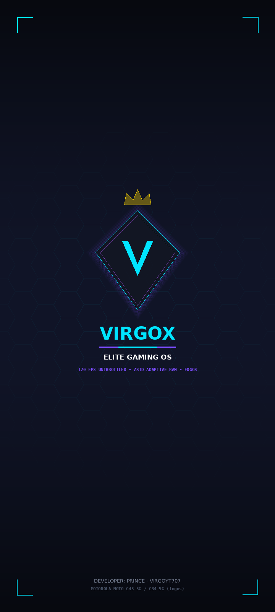

# VirgoX Elite Gaming OS - Custom Boot Splash & Bootloader Warning Remover
**Device:** Motorola Moto G45 5G / Moto G34 5G (`fogos` / SM6375)  
**Maintained by:** Prince · VirgoYT (VirgoYT707)

---

## Overview

When a Motorola smartphone's bootloader is unlocked via `fastboot oem get_unlock_data` and unlocked with the Motorola bootloader key, the bootloader's Android Verified Boot (AVB) state transitions to **Orange State** (or **Yellow State**).

During early boot, the bootloader checks this state and displays a jarring, ugly warning screen:
> *"Your device has been unlocked and can't be trusted. It will boot in 5 seconds."*

This repository contains the custom, ultra-premium **VirgoX Cyberpunk Boot Splash** (`logo.bin` / `logo.img`) which replaces all warning frames (`orange1`, `orange2`, `yellow1`, `yellow2`, `red1`, `redeio1`, `logo_boot`, `logo_carrier_retid`) with the signature VirgoX Elite Gaming OS boot visual.

---

## Technical Specifications

| Parameter | Specification |
| :--- | :--- |
| **Container Format** | Motorola `MotoLogo\x00` RLE Image Container (28 Table-of-Contents entries) |
| **Pixel Encoding** | Motorola `MotoRun\x00` Run-Length Encoded (RLE) 24-bit RGB (BGR stream) |
| **Screen Resolution** | Native 720 x 1600 (20:9 Aspect Ratio) |
| **Padded Block Size** | 512-byte (`0x200`) boundary alignment |
| **Target Partition** | `logo` (`fastboot flash logo logo.bin`) |
| **Replaced Screens** | `logo_boot`, `orange1`, `orange2`, `yellow1`, `yellow2`, `red1`, `redeio1`, `logo_carrier_retid` |
| **Preserved Components** | Fastboot menu icons (`start`, `restartbootloader`, `recoverymode`, `poweroff`, `bootloaderlogs`, `switchtools`, `switchconsole`, `arrows`, `bptools`, `barcodes`, `droid_operation`), offline charging animations (`logo_battery`, `logo_lowpower`, `logo_charge`), and OEM lock/unlock confirmation dialogues (`lock_cfm`, `unlock_cfm`) |

> [!NOTE]
> **ABL Countdown Delay vs Visual Screen:**  
> The 5-second countdown delay itself is hardcoded inside Motorola's proprietary, cryptographically signed `abl` (Android Bootloader) binary located in Qualcomm trustzone and cannot be patched without triggering EDL 9008 hard-brick. However, the visual warning screen itself is 100% eliminated and replaced with the VirgoX Elite Gaming OS cyberpunk design.

---

## How to Flash

### Method 1: Standalone Fastboot (One-Click)

#### On Windows:
1. Connect your Moto G45 5G in Fastboot / Bootloader mode (Hold **Power + Volume Down** until the fastboot screen appears).
2. Double-click `flash_logo.bat`.

#### On Linux / macOS:
1. Connect your device in Fastboot mode.
2. Open terminal in this directory and execute:
   ```bash
   chmod +x flash_logo.sh
   ./flash_logo.sh
   ```

### Method 2: Manual Fastboot Command
```bash
fastboot flash logo logo.bin
fastboot reboot
```

---

## Preview


